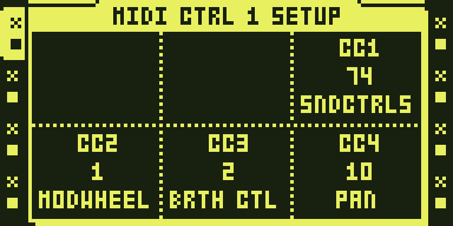
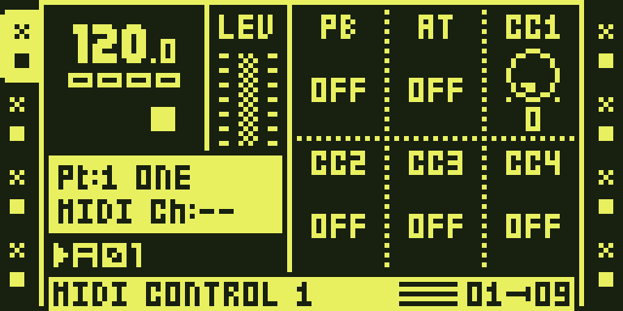
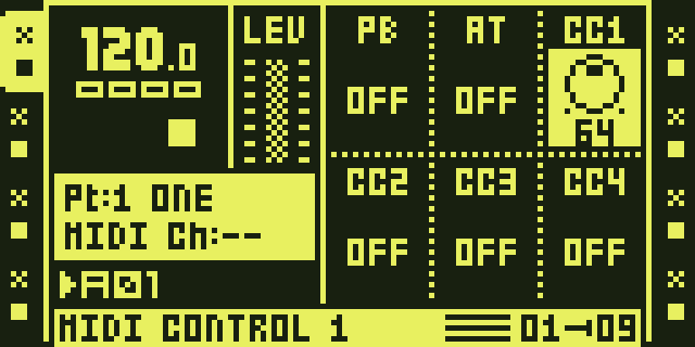

# `midi-scenes` — MIDI SCENES

MIDI-driven scene locks from
[bkkbrls-del/midisc](https://github.com/bkkbrls-del/midisc) **MIDISC2.0**
(standalone documentation in `upstream/README.md`). Octamod still packages the
relocatable GNU assembly units derived from the earlier `1.40MIDISC8.2` pin
(`upstream/gas/`) until a full MIDISC2.0 relocatable port lands. `Kind.CF_PATCH`:
twelve linker-placed units in DRAM, 38 detours, four pokes. No DSP code, no
menu row.

Stock 1.40C has no per-scene parameter lock over MIDI: XF morph reads one live
8×30 lock table that only the panel writes. midisc adds a second, addressable
table (`MSC`, `scene<<8 | track<<5 | flat`, 4 KB) and rewires scene hold, XF
morph, part save/reload and the scene clear/copy/paste rows to read and write
it when a MIDI event is driving. The panel path is untouched.

MIDISC2.0 standalone behaviour (author firmware line) also includes pre-trig
scenes/XF, pattern/Part boundary timing, unscened lock hold, CC-before-notes,
descriptor/scratch crash fixes, and Part sync at sequencer ACT commit.

Not carried into this Octamod package: MIDI → CONTROL CC48/55/56 tick rows
(UI-table pokes; off since 8.1); CCs behave as stock in an octabam image.

## Measured

- Under the ColdFire port: the boot detour reaches the loader, the loader's
  hash gates pass, the window reads back equal to the linked image except his
  own state words, i.e. his code ran from DRAM during boot. Arms the control
  fixture's five tracks.
- Standalone MIDISC2.0 (midisc `4f9a894`): **author-reported** hardware check
  on 1 October 2026 (see TESTING.md). Not an Octamod composition qualification.
- The Octamod native gas pin remains the relocatable 8.2-derived units from
  the octabam import; it is not yet a byte port of MIDISC2.0.

## On the unit

- Standalone MIDISC2.0 — author-reported, 1 Oct 2026 (see TESTING.md).
- Earlier OKMS1 remix (`ok-ms`, with Octakit) — 14 Sep 2026 (8.2-line port;
  historical; does not qualify this 0.2.0 catalog revision).

## Open

- Relocatable MIDISC2.0 packaging for Octamod composition (native gas still
  8.2-derived). Firmware builds remain pending for this 0.2.0 catalog version;
  standalone MIDISC2.0 behaviour is documented from the author line.
- The apply_part entry (`0x40009094`) stays stock since his 1.40MSCN6, so
  Octakit owns it alone and nothing bridges the two.
- His MIDI CONTROL tick rows, if wanted, need a menu-table mechanism.

## Gates

- `tools/verify/verify_midiscenes.py` (in `make verify`): every region
  assembles and links to his encoder's bytes at his addresses, and the
  committed `gas/*.s` are what `gas_port.py` regenerates.

## How it is built

His caves are written in his Python encoder (`upstream/tools/ot3_asm.py`) and placed
at fixed addresses by his `build.py`. His `upstream/tools/gas_port.py` drives the same
builders with an encoder subclass that records one GNU-as line per
instruction, writes `gas/*.s`, then assembles and links every region at his
address and compares. Cross-cave references are linker symbols, so octabam
places each unit where it chooses: every unit is `dram=True`, linked into the
platform runtime, appended behind octabam's loader and depacked at boot into
the arena reserve (`docs/contributing/PLACEMENT.md`). Inside the OS the module
changes only the detour and poke sites, plus the boot redirect when no other
module supplies it.

## Octamod update — 1 October 2026

Module version: `0.2.0-experimental`. Catalog/docs updated to author
**MIDISC2.0** ([bkkbrls-del/midisc@4f9a894](https://github.com/bkkbrls-del/midisc/commit/4f9a89453fdcdd39a3cd57f010ffa489cac721cd)).
Native relocatable units and octabam source pin remain the earlier import
([sambanks/octabam@363861e](https://github.com/sambanks/octabam/tree/363861e31ee963c478fab2b190a0fabe1d7ce37b/modules/midi-scenes)).
Firmware builds are enabled for this catalog revision (verified 8.2-derived packages). See [TESTING.md](TESTING.md).

## Access and actual OT UI captures

MIDI track parameter pages: hold SCENE A or SCENE B and edit an enabled parameter; the example uses MIDI CTRL 1.

1. Press MIDI to enter MIDI mode and select a track with its TRACK key.
2. For an external receiver, open MIDI NOTE SETUP with FUNC + SRC, choose CHAN with encoder A and press YES to confirm. The capture fixture has no connected receiver and leaves CHAN off.
3. For the illustrated CC example, hold FUNC and press FX1 to open MIDI CTRL 1 SETUP. Assign controller 74 to CC1 with encoder C and press YES to confirm.
4. Press FX1 to return to MIDI CTRL 1. Hold FUNC and press encoder C to enable CC1; its default OFF state cannot be edited as a normal active control.
5. Hold SCENE A or SCENE B and press a TRIG key to assign a scene to that side. Keep the scene key held and turn encoder C to set its CC1 scene lock. The pictured example locks CC1 to 64 while the base value is 0.
6. Release the scene key. Move the crossfader to morph the assigned scenes. Other supported MIDI parameter pages use the same hold-and-edit pattern.

These are actual firmware-rendered emulator LCD captures. See [TESTING.md](TESTING.md),
[capture provenance](media/capture.json) and [media rights](media/LICENSE.md).

The standard MIDI channel confirmation and FUNC + encoder activation steps
follow Elektron’s [MKII manual, MIDI track parameters](https://www.elektron.se/wp-content/uploads/2024/09/Octatrack-MKII-User-Manual_ENG_OS1.40A_210414.pdf#page=94).
MIDI scene locks are supplied by the pinned module; stock firmware does not
provide them. The capture leaves CHAN off because no receiver is connected.
