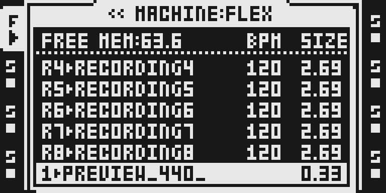
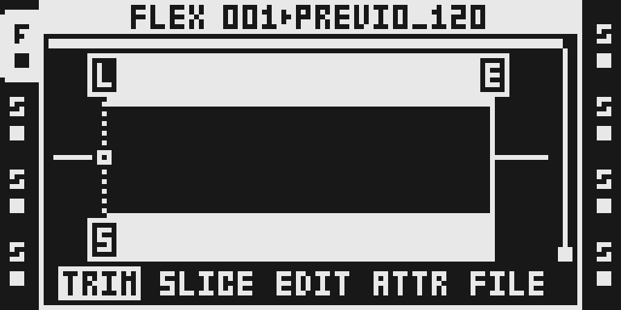

# Preview Vol

Version: `0.1.1-experimental`. Source repository: [repeat98/octamad](https://github.com/repeat98/octamad/tree/906fc354536d9a1d6ccd90a87fcf3c1f6edb6488/modules/previewvol).

**Source draft; publication and firmware builds remain blocked pending resource
qualification, real-hardware stress evidence and owner review.** The thumbnail,
complete documentation and actual MKII emulator screenshots are included for
review. The draft remains outside native discovery, the public catalog and
compiled packages; the eleven-module qualification baseline is unchanged.

## Overview

Preview Vol makes Flex/Static sample previews use the default AMP VOL (internal
value 64, shown as 0), regardless of the active track's AMP VOL. FUNC+YES routes
previews to main; CUE+YES routes to cue. Upstream reports that the track's own
AMP VOL returns when the preview stops. The source changes only preview AMP VOL:
track FX (unless PREVIEW WITHOUT FX), track MAIN/CUE LEVEL and mixer volumes
still apply. Samples with different recorded loudness can still sound different.
This is not loudness normalization, a limiter or a new effect algorithm.

## Controls

There is no module enable menu, effect slot or dedicated knob. Including a
qualified version in a build enables its two preview hooks automatically.

| Existing control | How to reach it | Relationship to Preview Vol |
| --- | --- | --- |
| Sample preview to main | FUNC+YES on the selected sample | Uses default preview AMP VOL |
| Sample preview to cue | CUE+YES on the selected sample | Same AMP override, cue routing |
| Track AMP VOL | AMP page, encoder D | Still controls ordinary track playback; not a preview-level knob |
| Track MAIN/CUE LEVEL and mixer volume | Existing track/mixer controls | Still affect preview output; not overridden |
| PREVIEW WITHOUT FX | Existing PERSONALIZE setting | Still determines whether track FX apply |

The captures confirm the shown MKII navigation and settings. They do not measure
audio output, establish hardware support or prove every interrupted-stop case.

## Usage

Select a Flex or Static audio track and double-tap its TRACK key to open the
sample slot list. Use UP/DOWN or LEVEL to select a sample. FUNC+YES previews to
main; CUE+YES previews to cue. From the slot list, YES opens LOAD FILE TO FLEX
or LOAD FILE TO STATIC; the same shortcuts audition files before assigning them.
With a loaded sample, AED on MKII opens the audio editor, another preview entry
point. Press NO to stop/leave preview access. The MKI editor route still requires
panel verification and must not be inferred from the MKII AED key.

Keep auditioning levels sensible: Preview Vol preserves sample loudness,
track/mixer levels and FX. Test ordinary track playback after stopping a preview
to verify AMP VOL restoration; a screen capture alone cannot prove the sound.

### Quick tutorial

1. Select a Flex or Static audio track, load a sample and double-tap its TRACK key to open the slot list.
2. Press AMP and turn encoder D to reduce the track AMP VOL; return to the sample list and hold FUNC while pressing YES to preview through main. Use CUE+YES to audition through cue.
3. Press NO to stop/leave preview access. Verify normal track playback uses the stored AMP VOL; compare both Flex and Static, then repeat from the file browser and MKII audio editor.

The fixture uses an original two-second 440 Hz stereo tone at 44.1 kHz, 16-bit,
120 BPM. T1 is Flex, T2 is Static, both use slot 1, and transport stays stopped.
The ordinary AMP page is captured with VOL reduced; no audio qualification is
claimed for this draft.

## Compatibility and limitations

- Base OS: locally verified 1.40C. Current UI captures use the MKII emulator.
  Real MKI/MKII audio behavior and the MKI editor route remain unqualified.
- No DSP algorithm or FX slot is added. The two linked ColdFire stubs override
  the pending AMP VOL byte in the Flex and Static preview starters.
- The isolated capture build retains stock effects and has no dynamic loader.
  Both hook targets, the added VOL write and the continuations were read back.
- Browser packaging, native composition/placement/rejection and byte parity
  with approved module combinations remain unverified, including Repitch's
  playback changes. An empty conflict list does not establish compatibility.
- Preview startup/stop under modulation, Part/machine changes, interruption,
  reselection and maximum audio/MIDI/USB load still needs qualification.
- Public availability requires actual cycle/memory reports, a passed one-hour
  real-hardware stress project, rights verification and owner approval.

## Tests and measurements

[TESTING.md](TESTING.md) records exact source/build/emulator identities, the
isolated capture procedure, fixture recipe, actual panel plan and limitations.
The current evidence establishes native hook readback and real LCD access
captures only. Worst-case cycles, full allocation/stack/peak totals and real
hardware stress remain unmeasured/untested. `tests.qualification` stays absent.
The incomplete `qualification.example.json` has populated documentation fields
for reuse, but its pending/null measurement fields deliberately fail validation.

`npm run check` performs static source integrity, draft/publication-boundary,
README/PNG and synthetic capture-preflight checks plus ordinary app validation.
It does not run firmware, DSP, emulator, audio or hardware qualification suites.

## Authorship and licences

The requested local folder contained only `__pycache__`; the authored source was
recovered from published commit `906fc354536d9a1d6ccd90a87fcf3c1f6edb6488`.
[The import record](../../imports/previewvol-906fc354.json) records original Git
blob/SHA-256 identities and both local stock guards. [OCTAMAD.md](OCTAMAD.md)
preserves the original README, and [LICENSE](LICENSE) retains the full MIT
notice and Sam Banks' copyright. `repeat98` maintains the snapshot repository;
precise module authorship and issue routing require owner confirmation because
the pinned native declaration has no per-module author field.

`previewvol.s` is unchanged. The two embedded stock expectations in the native
manifest become lazy address/length/SHA-256 reads through `remix.stock_guard`.
The original thumbnail is MIT. Documentary LCD screenshots retain Elektron UI
attribution; see [MEDIA_RIGHTS.md](MEDIA_RIGHTS.md). Contributor declarations,
permitted reuse and owner verification are required before publication. Review
is not automatic legal clearance.

## Screens and audio

These are actual firmware LCD pixels from the local Preview Vol build, rendered
at integer scale 6 in black-and-white. They are not mockups or reconstructed
labels. Exact PNG/build/emulator/source/fixture identities and panel actions are
in [the capture record](media/capture.json). The SVG above is an original
illustration, separate from the OT evidence. No audio preview is supplied.

Keep firmware, extracted stock, raw LCD/RAM dumps and project/card fixtures local
and temporary. Only reviewed screenshots and sanitized metadata enter this
folder. Before promotion, complete the current qualification/UI/rights gates
and verify supported combinations. Move the module into `sdk/octabam/modules/`
and add its exact catalog version only through an owner-reviewed PR. Owner merge
approves the qualified version; later source, documentation or media changes
require a strictly greater semantic version. Never expand the frozen baseline.
