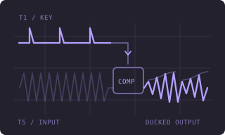
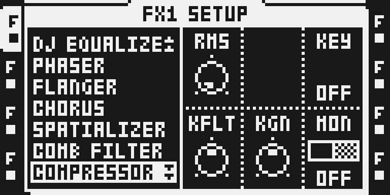
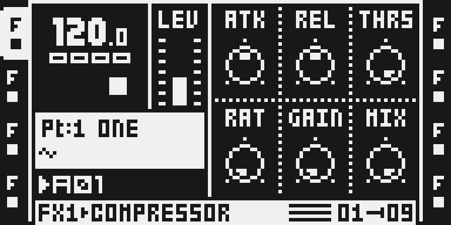
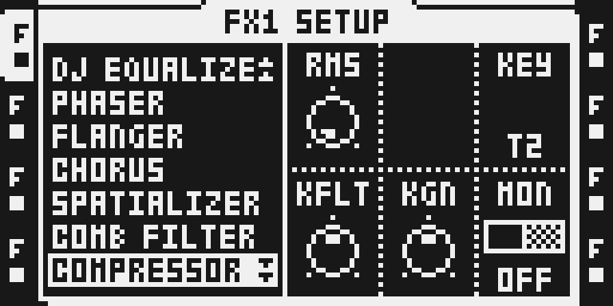

# Sidechain Compressor

## Overview

Drive the Octatrack stock **COMPRESSOR** detector from any audio track. A kick on T1 can duck a loop on T5, even though the tracks run on different DSP cores. KEY, KFLT, KGN and MON join RMS on page 2; all seven stock compression controls keep their stock behavior.

Version **0.1.0-experimental** is selectable and buildable in Modwerk as a standalone profile. Its complete firmware download matches the pinned native build byte for byte. Software cycle bounds and exact memory accounting are recorded in [TESTING.md](TESTING.md); the owner explicitly waived fresh physical hardware evidence.

## Controls

Values below are raw parameter values, rather than milliseconds or ratios. Stock defaults were read locally from the fingerprinted 1.40C descriptor. Native compression parameters stay inherited; the four added defaults are declared in manifest.py.

| Control | Default | Range | Behavior |
| --- | --- | --- | --- |
| ATK | 64 | 0-127 | Stock attack control, raw 0-127; determines how quickly compression engages. Exact time mapping is inherited from stock. |
| REL | 64 | 0-127 | Stock release control, raw 0-127; determines recovery after detector level falls. |
| THRS | 127 | 0-127 | Stock threshold, raw 0-127; lower it until the selected key causes gain reduction. |
| RAT | 0 | 0-127 | Stock compression ratio, raw 0-127; raise it to increase compression. |
| GAIN | 0 | 0-127 | Stock output make-up gain, raw 0-127. This is distinct from KGN, which changes the detector input. |
| MIX | 127 | 0-127 | Stock dry/wet balance, raw 0-127; 127 is fully processed and 0 is dry. |
| RMS | 0 | 0-127 | Stock RMS detector control, raw 0-127; retained on page 2 without changing its implementation. |
| KEY | 0 | OFF, T1-T8 | OFF restores self-keyed stock detection; 1-8 selects absolute T1-T8, including tracks on the other DSP core. |
| KFLT | 64 | 0-127 | 0-63 low-pass; 64 bypass; 65-127 high-pass. LCD shows LP/OFF/HP. One-pole filter uses a 32-entry 40-2200 Hz table and special near-bypass edges; no exact cutoff readout. |
| KGN | 64 | 0-127 | Raw 0-127 about unity at 64. Sixteen 8-value buckets yield -24 to +21 dB in 3 dB steps; the gain is smoothed with a nominal 5 ms block-rate time constant. LCD displays the stock bipolar raw offset, not dB. |
| MON | 0 | OFF / ON | OFF is normal compression; ON plays the processed key on this receiving track instead of its output, after both effects. MON requires a selected KEY. |

Page 1 uses encoders A-F for ATK, REL, THRS, RAT, GAIN and MIX. The SETUP page (page 2) retains RMS and uses C for KEY, D for KFLT, E for KGN and F for MON. The native declaration preserves the stock descriptor fields for slots 0-7; it does not create a new control for the blank slot.

KFLT filters only the detector key. KGN changes the key level, while GAIN changes output make-up gain. KGN's 16 buckets mean the top bucket is +21 dB, despite the approximate +/-24 dB description upstream. The one-pole key filter and gain state reuse stock COMPRESSOR per-instance memory. No exact hardware latency or utilization is claimed.

MON replaces the receiving track's committed output after its whole FX1/FX2 chain. Turn it off for normal listening. With KEY OFF, MON has no processed external key to audition.

## Usage

Select an audio track, hold FUNC and press FX1 or FX2 for SETUP, turn LEVEL to **COMPRESSOR**, then press YES. The effect name and ID remain stock COMPRESSOR, not SIDECHAIN_COMPRESSOR. Press the FX button for the main page; hold FUNC and press it to return to SETUP (page 2), which also contains the chooser. These panel instructions are checked against the actual MKII LCD captures below. The author reports MKI operation; fresh physical testing of this exact Modwerk image is owner-waived.

Keep levels low while auditioning the key. Restore self-keying with KEY OFF and MON OFF. Use MIX 0 for a dry comparison or select NONE to remove the effect. Returning to stock firmware removes these four controls; don't rely on saved sidechain values surviving a different composition. Back up projects before switching builds and reassign any SPRING REV slots.

### Quick tutorial: duck T5 from a T1 kick

1. Back up the project, work on a disposable copy, and put a kick on T1 and a sustained sample or loop on T5. Use a locally verified sidechain build with SPRING REV removed.
2. Select T5, hold FUNC and press FX1, turn LEVEL to COMPRESSOR and press YES. Press FX1 for the main page; hold FUNC and press FX1 to return to SETUP with the key controls.
3. Set KEY to T1, KFLT to 64, KGN to 64 and MON to OFF. On the main page, keep MIX at 127, raise RAT and lower THRS until the T5 signal dips when the T1 kick plays; adjust ATK and REL for the desired envelope.
4. Briefly set MON to ON on page 2 to hear the processed T1 key on T5, then return MON to OFF. Try KFLT below 64 to focus on bass, or above 64 to remove bass from the detector.
5. Return KEY to OFF and MON to OFF to restore self-keyed stock compression. Set MIX to 0 for the dry signal or select NONE to remove this effect; stop transport before saving the disposable project.

## Compatibility and limitations

- Original OS **1.40C**, Octatrack MKI/MKII; the locally captured panel is MKII.
- Replaces stock COMPRESSOR on **both FX1 and FX2**, ID **0x18**; stock init/proc dispatch entries stay unchanged.
- The native proof profile removes **SPRING REV** as a code donor and retains its 35-word helper used by DARK REV. PLATE/DARK REV remain selected. Old SPRING REV project assignments need reassignment.
- **BusDelay and BusVerb are incompatible**: their private/shared Y reservations overlap the keybus/window. They are not imported by this request.
- No MUTE_MODES module is imported. The upstream muted-key report concerns a combined image with its matching MUTE_MODES variant; do not infer the same behavior under every mute mode in this profile.
- Both-core timing/rate locking, simultaneous instances sharing one KEY, detector state transitions, stale MON behavior on effect changes, maximum load, persistent project reload and recovery remain qualification cases.
- Select this module alone. Its verified profile removes SPRING REV and includes no appended Core Logger; Modwerk refuses all fourteen companion modules in either selection order. The stock FX2 retention switch produces the same fixed profile in either position.
- Firmware, private project/card state and extracted stock bytes stay local.

## Tests and measurements

[TESTING.md](TESTING.md) and [native-evidence.json](reports/native-evidence.json) give the pinned source/build/tool identities and actual results. The 134-byte ColdFire UI unit matches its author reference. Both cores place 340 DSP code words and 48 identical table words; only the two documented table-load substitutions differ from the standalone instructions.

Exact accounting for sixteen instances is **23,292 logical bytes**, including inherited instance/scratch/stack capacities and all authored code/tables, Y windows, descriptor, chooser and extra formatter stack. No new heap, SDRAM or delay buffer is allocated. The conditional DSP bound is **69,496 cycles/core/block** against **72,560**, including stock reserve and a 2× instruction-model allowance. These are software bounds under stated assumptions; silicon timing and current-build hardware canaries are unmeasured.

The author's MKI report from 4 October 2026 is attributed in TESTING.md. It is upstream evidence, not a test of this Modwerk version/local image.

## Authorship and licences

Zac Kyoti (@Zac-Kyoti) and the OT Kyoti FW contributors wrote the sidechain source, table generator and standalone build. Sam Banks (@sambanks) integrated it into octabam. This import pins octabam f80ecfeabc187a33403588678e707443161afc96 and author d3e0801a5f666abc04bc05fc1cb37969d7fb38d0.

[LICENSE](LICENSE) and [upstream/LICENSE](upstream/LICENSE) preserve the full MIT terms, copyright and exclusions. Modwerk's original documentation/thumbnail uses MIT. The author assembly and table generator remain byte-identical; the native manifest changes only paths and replaces stock expectation literals with lazy fingerprinted local reads. Per-file provenance and transforms are in [the import record](../../../imports/sidechain-compressor-f80ecfe.json).

No Elektron firmware or private project/card is part of this source distribution. LCD captures have a separate rights declaration; underlying Elektron rights remain reserved.

## Screens and audio

These reviewed, unedited MKII framebuffer captures show selection/SETUP, the main page and KEY T2 chosen with encoder C. [Capture provenance](media/capture.json) preserves the exact panel plan, source/image/emulator/card hashes and setup. [Media rights](media/LICENSE.md) reserves underlying Elektron rights. The T1-to-T5 tutorial is a source-described audio exercise, not a result from this stopped capture session. No audio is included.

The original routing thumbnail above is an illustration, not OT UI evidence.

## Developer build

Use a new private workspace, the exact octabam revision above, a reviewed matching DSP assembler/disassembler, GNU m68k-elf binutils and your own fingerprinted original 1.40C MAIN OS extraction. Copy only the pinned upstream tools/dsp and this folder as modules/sidechain-compressor; copy Modwerk's tools/remix/stock_guard.py into that native tools/remix directory. Select the upstream remixes/test/sidechain-compressor profile (stock effects with COMPRESSOR replaced and SPRING REV absent). Run with no network/credentials and source/toolchain read-only, output only in the private workspace:

    REMIX=sidechain-compressor XBUS=1 SPEC=1 DEV=0 NOROUNDTRIP=0 BUILD=81 python3 -B tools/build/build_bus.py

This is the **pinned native proof workflow**. Keep out/mainos_bus.bin and every generated firmware container private. Modwerk independently compiles authored source with tools/compile_package.py and reconstructs guarded stock fields from the user's original firmware. Its legacy mixed-remix SDK skips this newer declaration; existing packages remain independently checked.
