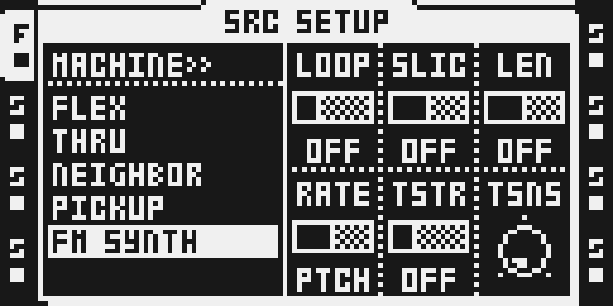
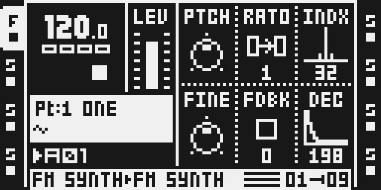
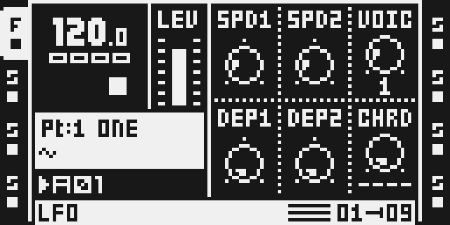
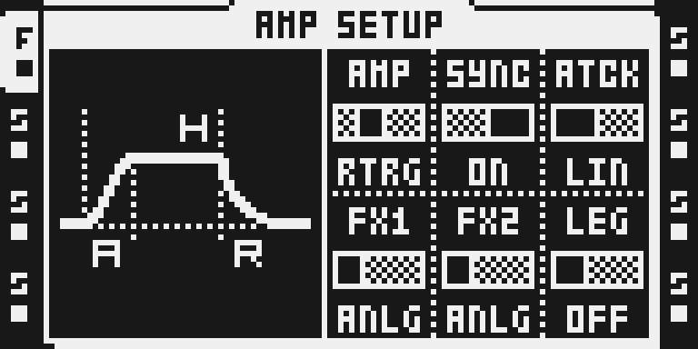
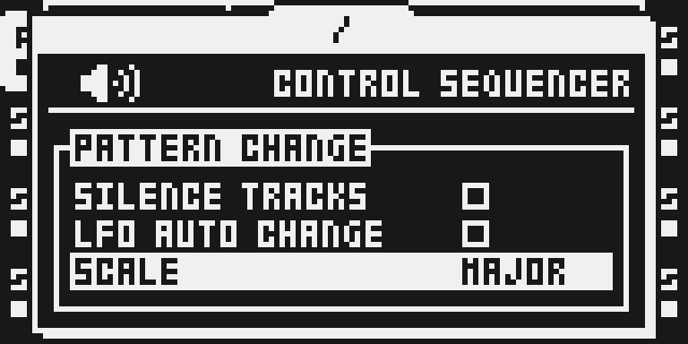
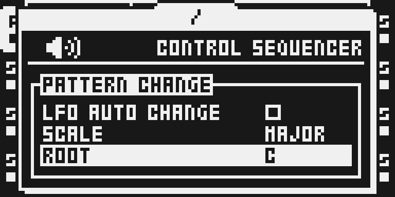
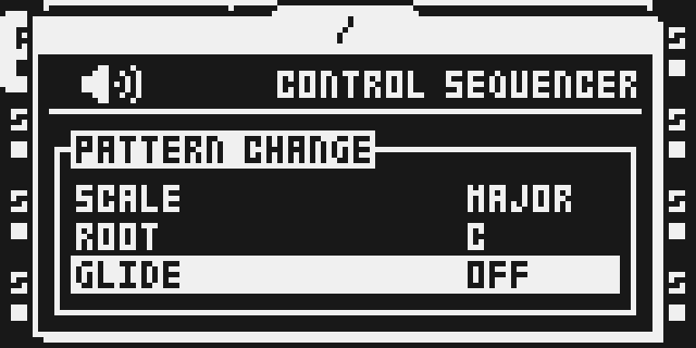

# FM Synth

## Overview

FM SYNTH is a dedicated track machine beside FLEX, STATIC, THRU, NEIGHBOR and PICKUP. It uses Tim Hastie’s octatrick v2.9 two-operator FM engine: a sine carrier with a sine modulator, feedback and an index-decay envelope. One to four paraphonic voices feed the track’s existing AMP, filter and effects.

The dedicated machine plays without a sample. This experimental version has emulator playback and shared native/browser composition evidence. Hardware is untested; the owner approved publication without current hardware evidence, worst-case chip timing or complete stack/lifetime memory bounds on 6 October 2026. These measurements remain unknown; see TESTING.md for the release limits.

## Controls

| Page | Control | Initial value / range | Function |
| --- | --- | --- | --- |
| SRC A | PTCH | raw 64; −64…+63 semitones | Carrier pitch; chromatic and scale edits constrain notes. |
| SRC B | RATO | raw 12 = 1; 32 ratios 0.25…16 | Modulator/carrier frequency ratio; four raw values per position. |
| SRC C | INDX | 32; 0…127 | FM depth; 0 gives the unmodulated carrier. |
| SRC D | FINE | raw 64 = 0; −64…+63 cents | Fine pitch tuning. |
| SRC E | FDBK | 0; 0…127 | Modulator feedback. |
| SRC F | DEC | raw 40 ≈ 199 ms; 0…127 | Decay of modulation index, separate from amplitude. |
| LFO C | VOIC | effective 1; 1…4 | Paraphonic voices. Inherited raw values outside 1…4 normalize to 1. |
| LFO F | CHRD | ----; 32 shapes × 4 inversions | Chord shape and inversion; raw `shape<<2 | inversion`. |
| FUNC+AMP F | LEG | OFF / MONO / POLY | Retrigger or overlapping mono/paraphonic legato. |
| PROJECT > CONTROL > SEQUENCER | SCALE | OFF; 24 scales | Scale quantization of pitch edits and chromatic playing. |
| Same menu | ROOT | C; 12 roots | Key of the active scale. |
| Same menu | GLIDE | OFF; raw 0…127 | Pitch slide time, interpreted with LEG. |

AMP ATK, HOLD and REL are inherited Part values and shape the engine’s own gain envelope. First selection initializes the twelve SRC main/setup bytes and preserves them on reselection. It retains the other existing Part controls. LFO3’s speed and depth become VOIC/CHRD; its depth contribution is muted. Four voices share the track’s filtering and envelope path. The original [author documentation](upstream/synth/README.md) describes chord shapes, MIDI, keyboard recording and envelope details; those broader paths have not been qualified for this adaptation.

## Usage

Start with one audio track and a simple trig pattern; the tutorial below selects the machine, shapes its sound and stops it.

### Quick tutorial: play FM Synth

1. Open a disposable project with FM Synth firmware. Select an audio track, hold FUNC and press SRC, select FM SYNTH with UP/DOWN and press YES. No sample is required.
2. Press SRC. Set RATO to 1 and turn INDX from 0 upwards to hear a sine tone acquire FM harmonics. PTCH transposes it; FINE tunes it in cents; FDBK adds feedback; DEC shortens the modulation envelope.
3. Place a trig and press PLAY. Press LFO to set VOIC to 2–4 and CHRD to a chord if wanted. AMP ATK/HOLD/REL shape the gain envelope; FUNC+AMP exposes LEG.
4. Press STOP twice to silence the voice. To return to a sample machine, hold FUNC and press SRC, select FLEX or STATIC and press YES; assign the desired sample in the normal way.

For scales and glide, open PROJECT > CONTROL > SEQUENCER. Select SCALE, ROOT or GLIDE with UP/DOWN and turn LEVEL. SCALE OFF restores unquantized pitch.

Trigs, note starts and stops come from the instrument’s existing sequencer and panel/MIDI paths. The audio oscillator necessarily advances at the audio sample rate, including live playing while transport is stopped; it is not a second sequencer clock. The upstream HOLD/chord/glide logic reads the stock tempo/track clock. Tempo changes, non-default track speed/length, swing and loop/pattern transitions are not tested in this version.

## Compatibility and limitations

OS 1.40C only. Parts store internal FLEX kind 1 plus `FM/1` in unused NEIGHBOR bytes, in both the live Part and its battery-RAM shadow. The chooser keeps the ordinary sample slots unchanged. A stock build reads the track as FLEX and cannot synthesize FM; select a stock machine explicitly before downgrading. Saved-file reload and migration from upstream marker projects are not tested.

The matching quantizer is bundled privately because FM shares its mailbox and scale accessor. Do not combine with the public Scale Quantizer or Analog BD: their hooks/caves overlap. The shared builders agree across 94 configurations (37 built, 57 refused), including Repitch and other compatible modules. Only standalone FM playback is audio-tested; mixed builds have byte-parity evidence, not audio stress evidence. Legacy marker recognition remains in the upstream engine, but the verified route uses the dedicated chooser.

Maximum voices, eight simultaneous audio tracks, modulation, MIDI, parameter locks, neighbouring sample playback, Part/pattern changes, save/reload and real hardware are not tested. Do not infer real-time headroom or project persistence from the UI/storage smoke.

## Tests and measurements

See [TESTING.md](TESTING.md). The isolated native build passes. Actual LCD captures show the machine, SRC, voices/chords, LEG and all scale/glide rows. Native panel checks pass for selection on T1–T8, SRC defaults, live/shadow signatures, sample-slot preservation, reselection and return to FLEX. Local Octemu playback passes with every audio file removed from a private fixture copy; the generated carrier is about 261 Hz and double-STOP reaches silence.

The shared native platform reserves 1,707 × 6,144 = 10,487,808 audio-arena bytes. This reservation is not the module’s complete memory inventory. Chip worst-case cycles and current hardware are unmeasured/untested. `qualification.example.json` is a pending worksheet, not publication evidence.

## Authorship and licences

Tim Hastie: FM engine, voices/chords, MIDI/legato and matching quantizer, pinned to `525f4b19b04dc3ba3f3bae3b25abbf48df34a10a` (v2.9). Sam Banks: octabam wrapper/platform, pinned to `949f3be15eae5d3d16a7682b9e3218d42f6c1284`. Modwerk contributors: dedicated chooser and Part validation, sample-free source/START transport, verification, docs and original SVG. Full MIT terms are in [LICENSE](LICENSE), with the author originals retained. The import inventory is [synth-949f3be.json](../../../imports/synth-949f3be.json).

No firmware, extracted stock byte blobs/tables, cards, RAM dumps or compiled images are distributed. Stock expectations resolve lazily from the verified developer-owned OS by address, length and SHA-256.

## Screens and audio

These are actual monochrome emulator LCD exports, visually reviewed, bound to the native image in [media/capture.json](media/capture.json). They are emulator evidence; no hardware capture is claimed. See [media/LICENSE.md](media/LICENSE.md) for the interface rights declaration and [presentation/thumbnail.svg](presentation/thumbnail.svg) for original art.

Only sanitized audio measurements are retained. The temporary Octemu WAV, card, battery file and firmware remain local and are excluded from the submission.
