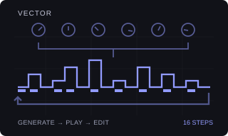
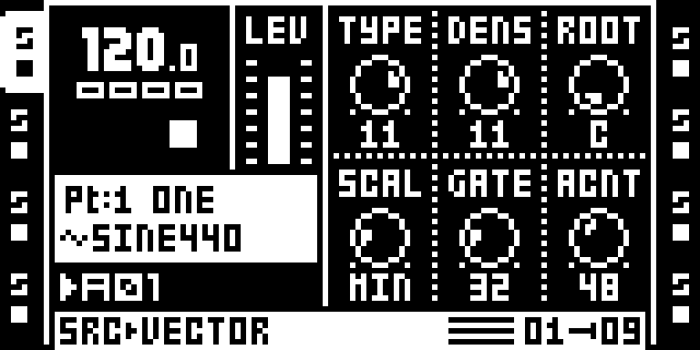
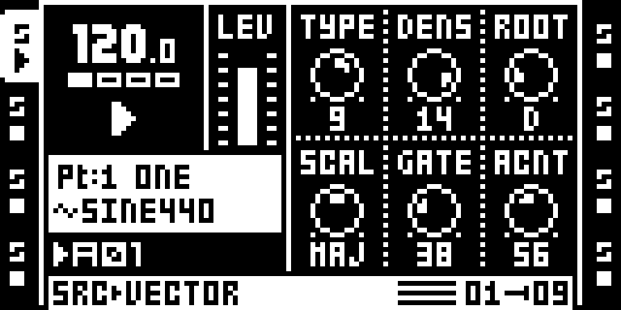
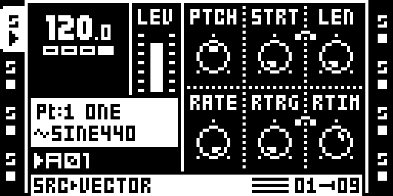
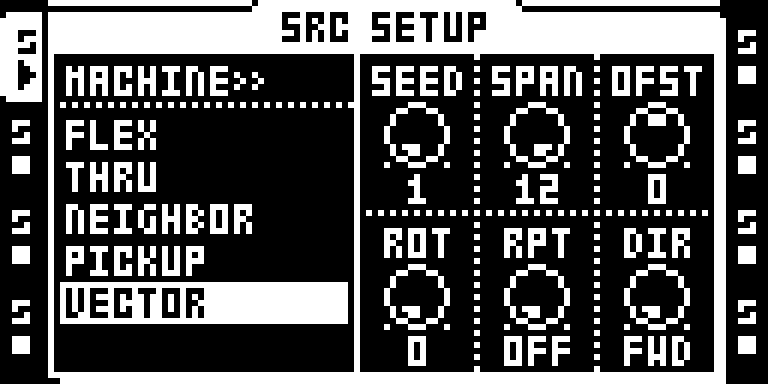
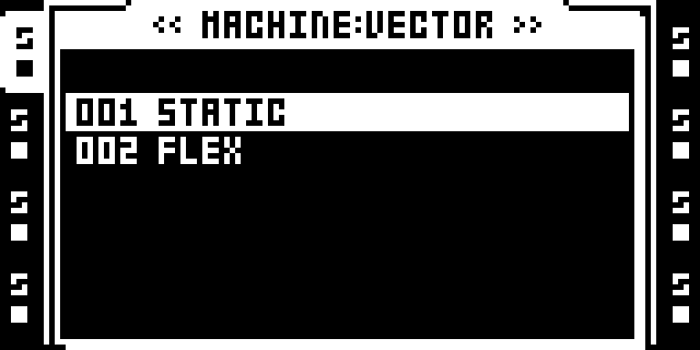
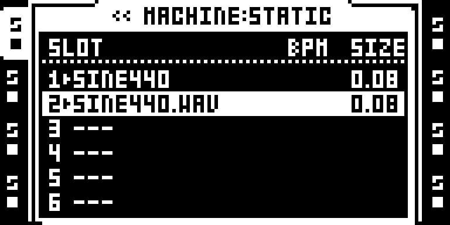
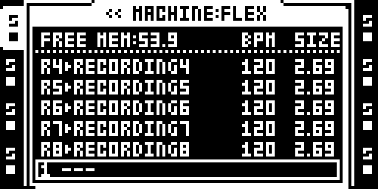

# VECTOR

Version: `0.2.3-experimental` · author: @repeat98 / Octamod contributors.

Native SRC generator for Flex and Static samples. Physical hardware remains untested; the owner approved this exact release using emulator evidence while their OT is in repair.

## Overview

VECTOR creates real note trigs and PTCH/HOLD/VOL locks for one Flex or Static sample. Turn a generator parameter on either native SRC page to commit the sequence immediately, including while playing. Knob edits keep the current seed; YES makes a fresh variation. The normal Octatrack track display, sample name, Part, native dials and sequencer remain in use. No generator window is allocated.

The algorithm is original, inspired by Iftah’s Sting 2; no Sting source or artwork was copied. It generates internal sample notes and emits no MIDI. STOP/PLAY preserves populated tracks. When native playback starts, VECTOR fills only empty tracks and refuses existing note, recorder, trigless, slide or lock data.

## Controls

| Page | Encoder | Control | Default | Behavior |
|---|---|---|---|---|
| 1 | A | TYPE | 11 | 0–15. Low values favor varied scale notes; higher values prefer tonic/fifth and stronger beat positions. Original algorithm; not a byte-identical Sting port. |
| 1 | B | DENS | 11 | 0–16. Note count is round(motif length × DENS / 16). Zero is silence; 16 fills the motif. Changes commit immediately with the current seed. |
| 1 | C | ROOT | 0 | C–B. Sample reference is C at neutral PTCH. Tune the source sample accordingly. Pitch locks stay within −12 to +12 semitones. |
| 1 | D | SCAL | 1 | Chromatic, natural minor, major, Dorian or minor pentatonic. All generated pitches remain in the selected scale. |
| 1 | E | GATE | 32 | 0–126 in native AMP HOLD units, not percent or milliseconds. Generated HOLD locks range from half to all of this value. AMP REL still shapes the audible tail. |
| 1 | F | ACNT | 48 | 0–127. Strong notes keep the Part AMP VOL. Other notes are attenuated by up to half; zero gives equal volumes. This writes AMP VOL locks, not MIDI velocity. |
| 2 | A | SEED | 1 | 0–127. Select the deterministic variation; YES advances and wraps this value. Other parameter edits keep it fixed. |
| 2 | B | SPAN | 12 | 0–12 semitones either side of OFST, clipped to the native ±12-semitone range. Pitches remain in the selected scale; an empty window uses its nearest scale note. |
| 2 | C | OFST | 12 | Displayed as −12 to +12 semitones; stored midpoint 12 means zero. Moves the center of the pitch window. |
| 2 | D | ROT | 0 | 0–63 steps. Rotate the generated phrase right within the native track length. |
| 2 | E | RPT | 0 | OFF (0) uses the full native track length. 1–64 chooses a repeating motif; larger values are clipped to the active length. |
| 2 | F | DIR | 0 | FWD or REV. Reverse the generated phrase before applying ROT. |

SRC page 2 is the native SRC SETUP page, reached by a double tap on SRC. Push LEVEL on the main page to use ordinary sample controls; while in that edit view, SRC SETUP also restores the stock Flex/Static setup controls. Holding a trig or scene on SRC uses native sample controls so the generated pitch locks remain editable.

ROOT assumes the source sample sounds C at neutral PTCH. GATE is the native AMP HOLD value; AMP REL still shapes the tail. ACNT writes volume locks, rather than MIDI velocity. Native pattern length, track speed and swing remain the normal sequencer settings. ROT and DIR move the whole generated phrase; RPT repeats a motif inside the native track length.

## Usage

Start with a disposable local project. Choose VECTOR, then select its Static or Flex backing pool and load a tuned one-shot through the stock sample browser. Turn DENS to generate a phrase, press PLAY, then shape it while listening. Use page 2 for the seed, pitch window and phrase structure. Turn a control only when you intend to replace the generated notes on that track.

The generator owns note masks and PTCH/HOLD/VOL locks across the 64-step lane. Generation also resets the note timing, conditions, one-shot and slide state for old/new notes. Recorder events, swing and unrelated sample/FX/LFO locks stay intact. A preserved lock on a new rest becomes a trigless lock. There is no custom Undo: duplicate a pattern before replacing edits you want to keep.

The Part’s unused PICKUP slots store the marker and nine packed settings bytes; all writes stay within that track’s two six-byte slots and its SRAM mirror. Older draft markers migrate in place with default secondary controls. Native save/reload and power-cycle persistence still need testing. Selecting normal Flex/Static removes the marker while retaining the phrase.

## Generate a phrase, then edit a note

1. Select an audio track. Open SRC page 2 (double-tap SRC), choose VECTOR and press YES. In the backing-pool modal, highlight STATIC or FLEX with UP/DOWN or LEVEL, then press RIGHT to enter that pool. YES also opens the highlighted pool; YES on a loaded sample slot assigns that pool and sample to VECTOR. Use the corresponding stock sample-slot and file-loading tools to load a tuned sample; NO returns from the sample browser.

2. Double-tap the assigned TRACK to reopen the pool modal. LEFT returns to the machine list; RIGHT on VECTOR opens the modal. RIGHT in the pool modal opens the highlighted Static/Flex sample list. In a sample-slot list, LEFT returns to pool choice and RIGHT opens the stock file browser. Horizontal arrows navigate menus without changing the assigned pool; YES on a sample slot commits the pool and sample.

3. Press SRC for TYPE, DENS, ROOT, SCAL, GATE and ACNT on encoders A–F. Turn a parameter to commit a phrase immediately, including during playback. The current seed stays fixed while shaping the vector.

4. Open SRC page 2 with a double tap on SRC. Encoders A–F adjust SEED, SPAN, OFST, ROT, RPT and DIR. These changes also commit immediately; press SRC to return.

5. Press PLAY to hear the native sequencer repeat the phrase. Push LEVEL on SRC for the ordinary sample controls, then use grid recording and a held trig to edit PTCH. AMP exposes the generated HOLD/VOL locks. Push LEVEL again to return.

6. Press YES on the generator for a new seed and variation. STOP/PLAY preserves a populated phrase. Select normal FLEX/STATIC to remove VECTOR while retaining the generated pattern.

The modal uses the stock list controller and window chrome, as Analog BD does for 808/909. Confirming a stock sample slot preserves VECTOR, its generator parameters and the current phrase. NO cancels a pool choice without changing the backing pool.

## Compatibility and limitations

OS 1.40C is the local base. Captures and sequence checks use octemu’s MKII panel. Hardware and MKI support remain unverified. Generation runs on the UI task; the adapter uses native lock-index rebuilding and live track publication. This emulator result does not establish hardware race safety or an audio continuity guarantee.

Analog BD shares chooser/display hook sites and conflicts. Other combinations, including OctaKit, need explicit integration checks. Generator settings are not LFO, scene or p-lock destinations; the ordinary sample controls remain available through the edit view. Pitch is limited to ±12 semitones.

The shared DRAM loader reserves 1,707 audio pages / 10,487,808 bytes. VECTOR adds no DSP kernel. Full code, stack, allocator and maximum-instance accounting remain pending.

## Tests and measurements

See [TESTING.md](TESTING.md). Sanitizer tests cover the firmware-free C engine, secondary controls, packed settings and native-record writer. Emulator evidence separately covers real panel navigation and sequence-record changes during playback. Both backing-pool browsers, file loading, sample confirmation, menu navigation and cancellation are checked in the emulator. Save/reload and power-cycle persistence, hardware audio continuity and mixed-module maximum-load playback remain untested. The release includes source packaging, a conditional resource model and browser/native parity checks.

Run `prepare.py` in the isolated toolchain to regenerate authored `control.s`; its four replay spans remain zero placeholders. The shared native/browser builders restore them from guarded local 1.40C firmware. Keep linked ELF, firmware, cards and dumps private. `verify_native.py` checks sanitizer cases and assembly reproducibility; it does not claim a hardware test.

## Authorship and licences

Original generator, tests, documentation and illustration: Octamod contributors, MIT. Native chooser/input-layer/draw interoperability follows MIT octabam by Sam Banks and repeat98. See [LICENSE](LICENSE). Sting 2 is musical inspiration; no source, branding artwork or assets were copied.

The thumbnail is an original illustration under [presentation/LICENSE](presentation/LICENSE). Native LCD captures are documented under [media/LICENSE.md](media/LICENSE.md); underlying Elektron rights remain reserved. No firmware, extracted routines, cards, samples or raw memory/LCD dumps are included.

## Screens and audio

[media/capture.json](media/capture.json) binds the screenshots to the current source, image and panel walk. No hardware test or qualified audio preview is claimed.

VECTOR is selected in the normal SRC SETUP machine list.

SRC page 1 uses the normal six native cells: TYPE, DENS, ROOT, SCAL, GATE and ACNT.

YES advances SEED and commits a fresh variation; turning a parameter commits with the current seed.

Push LEVEL to access native PTCH, STRT, LEN, RATE, RTRG and RTIM.

SRC page 2 holds SEED, SPAN, OFST, ROT, RPT and DIR in the native SRC SETUP layout.

VECTOR uses the stock list modal with visible left and right chevrons. RIGHT enters the highlighted pool.

RIGHT on STATIC opens the existing Static sample-slot tools.

RIGHT on FLEX opens the existing Flex sample and recorder-slot tools.
